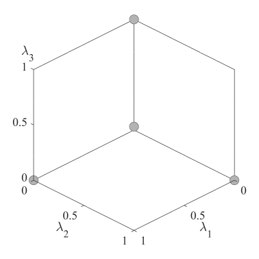
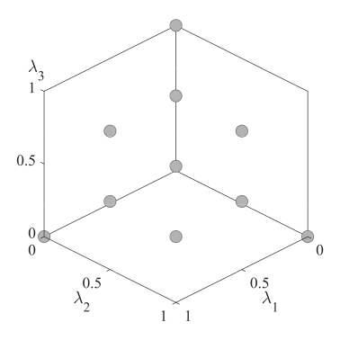
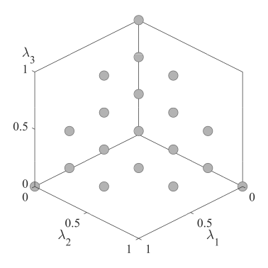
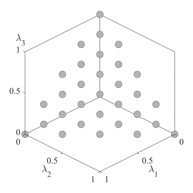
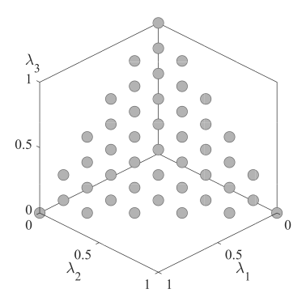
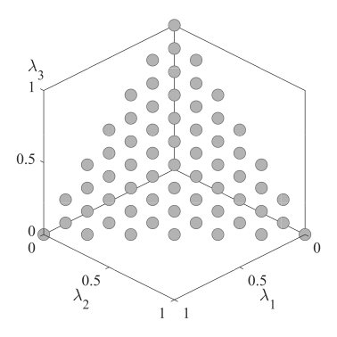

# Incremental Lattice Design
 Incremental lattice desigin  of Weight Vector Set

## Sample image of weight vector set
|Three-objective problems, parameter H=1|Three-objective problems, parameter H=2|Three-objective  problems, parameter H=3
|:-:|:-:|:-:|
|Three-objective problems, parameter H=4|Three-objective problems, parameter H=5|Three-objective problems, parameter H=6|

## How to use
You can easily use this weight vector set by reading the [data](data).  
If the data you want isn't there, you can use [ILD.m](ILD/ILD.m) to create the data you need.  

If you want to use this weight vector set in [PlatEMO](https://github.com/BIMK/PlatEMO), you can take two methods.  
One is to add [ILDPoint.m](ILD/ILDPoint.m) in "/PlatEMO-master/PlatEMO/Public" and call it from the algorithm.  
For example, change UniformPoint(Global.N,Global.M) to ILDPoint(Global.N,Global.M).  
The other one simply replaces "/PlatEMO-master/PlatEMO/Public/UniformPoint.m" with [UniformPoint.m](ILD/UniformPoint.m).

## Reference 
Tomoaki Takagi, Keiki Takadama, and Hiroyuki Sato, **Incremental Lattice Design of Weight Vector Set**, Proceedings of the 2020 Genetic and Evolutionary Computation Conference Companion, 2020, 1486-1494.